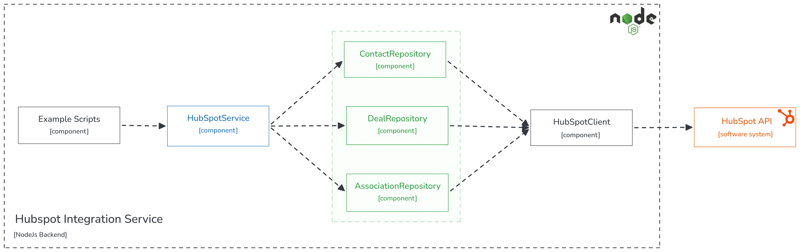

# HubSpot CRM Integration - Node.js

A layered Node.js service that integrates with the HubSpot CRM, covering both halves of the technical test: Section 1 (Node.js fundamentals, callbacks, Promises/async-await, CommonJS modules, streams) and Section 2 (Contacts and Deals management against a live portal).

Every HTTP call in this repo hits the real HubSpot API. No mocks, no simulated responses. The code is organized into production-shaped layers, config, HTTP client, domain repositories, orchestration service, and executable examples, so pagination, rate limits, retries, and idempotent sync are handled where they belong, not buried in standalone scripts.

## Setup

```bash
npm install
cp .env.example .env   # fill in your values, see below
```

Node 20+. Runtime dependencies: `axios` (HTTP client) and `dotenv` (loads `.env`); tests use the built-in `node:test`.

| Variable | Value |
|---|---|
| `HUBSPOT_ACCESS_TOKEN` | Service Key token (`pat-na1-...`) |
| `HUBSPOT_PIPELINE_ID` | deal pipeline internal ID, default `default` |
| `HUBSPOT_STAGE_ID` | deal stage internal ID, default `appointmentscheduled` |
| `HUBSPOT_MAX_RETRIES` | default `3` |
| `HUBSPOT_RETRY_BASE_DELAY_MS` | default `500` |

Get your own pipeline/stage IDs with `node src/examples/list-pipelines.js` after setting the token.

Portal used for this submission: `52016473` (`https://app.hubspot.com/contacts/52016473`).

**Credential**: private-app *creation* is being phased out on HubSpot's Unified Developer Platform. Use a **Service Key** instead, same token format, same scopes, same endpoints, just a different place to generate it.

1. Portal → **Development** → **Keys** → **Service keys** → **Create service key**.
2. Scopes: `crm.objects.contacts.read`, `crm.objects.contacts.write`, `crm.objects.deals.read`, `crm.objects.deals.write`.
3. Portal ID is the number in the record URL (`app.hubspot.com/contacts/{PORTAL_ID}/record/...`), not `hs_object_source_id`, which identifies the integration, not the portal. Cost me one wrong value in an earlier draft; caught it by reading the raw API response instead of trusting the account URL.
4. `node src/examples/sync-deals.js` needs a custom deal property, `sync_external_id`, marked **unique value**, or it fails with `PROPERTY_DOESNT_EXIST`. Create it once: Settings → Properties → Deals → Create property → single-line text → advanced options → "unique value". (See "Idempotent sync" under Decisions for why.)

## Architecture



Every `examples/*.js` script goes through `hubSpotService`, no exceptions. Most CRUD is a one-line delegation there; the service only holds logic a caller shouldn't have to repeat (deal pipeline/stage defaults, sync input checks, per-chunk sync summaries). One rule, no special cases to memorize when reading the code.

Repositories own HubSpot's specific shapes (pagination cursors, `{id, properties:{...}}` nesting, the 100-input batch limit) and hand back flat objects. `hubSpotClient` is the only thing that knows about HTTP, auth header, timeout, retry/backoff.

```
src/
  config/         env loading, fails fast if HUBSPOT_ACCESS_TOKEN missing
  clients/        hubSpotClient.js, axios instance + retry interceptor built on handleHubSpotErrors
  repositories/   contactRepository.js, dealRepository.js, associationRepository.js
  services/       hubSpotService.js, the only entry point examples call
  utils/          validateHubSpotPayload.js, handleHubSpotErrors.js, chunk.js, streams.js
  fundamentals/   Section 1, standalone, zero dependency on the rest of the repo
  examples/       hubSpotApiHandler: one executable script per function, real output to console
data/             seed JSON for the sync examples
test/             node:test, pure/no-network layer only
```

## Running Section 1 (fundamentals)

| Command | Demonstrates |
|---|---|
| `node src/fundamentals/callback.js` | `setTimeout` + callback |
| `node src/fundamentals/asyncAwait.js` | same, refactored to Promise + async/await |
| `node src/fundamentals/main.js` | CommonJS `require`/`module.exports` of `utils_module.js` |
| `node src/utils/streams.js` | `Readable` → uppercase `Transform` → `process.stdout`, joined with `stream.pipeline` so errors propagate |

## Running Section 2 (HubSpot)

`<arg>` is required, `[arg]` is optional.

| Command | Function |
|---|---|
| `node src/examples/list-pipelines.js` | `getDealPipelines` |
| `node src/examples/list-contact-names.js` | `getHubSpotContactNames` |
| `node src/examples/list-contacts.js [limit]` | `getHubSpotContacts` |
| `node src/examples/create-contact.js [firstname lastname email]` | `createHubSpotContact` |
| `node src/examples/update-contact.js <id> [firstname] [lastname] [email]` | `updateHubSpotContact` |
| `node src/examples/delete-contact.js <id>` | `deleteHubSpotContact` |
| `node src/examples/list-deals.js [limit]` | `getHubSpotDeals` |
| `node src/examples/create-deal.js [dealname amount]` | `createHubSpotDeal` |
| `node src/examples/update-deal.js <id> [dealname] [amount]` | `updateHubSpotDeal` |
| `node src/examples/delete-deal.js <id>` | `deleteHubSpotDeal` |
| `node src/examples/associate-contact-deal.js <contactId> <dealId>` | `associateContactToDeal`, idempotent, run it twice |
| `node src/examples/sync-contacts.js` | `syncContactsWithHubSpot`, upserts `data/contacts.json` |
| `node src/examples/sync-deals.js` | `syncDealsWithHubSpot`, upserts `data/deals.json` |

`data/*.json` are small seed files. Deal records skip `pipeline`/`dealstage`, those come from env, overridable per-record if present.

## Tests

```bash
npm test
```

Covers `validateHubSpotPayload`, `handleHubSpotErrors`, `chunk`, `sumArray`, `streams`, the pure layer, no network. Nothing else is unit-tested: the spec bans mocking HubSpot, and hitting the real API on every `npm test` run would mutate the portal every time. Repositories/services are verified by running the examples against a live portal instead.

## Endpoints

- [Contacts](https://developers.hubspot.com/docs/api/crm/contacts)
- [Deals](https://developers.hubspot.com/docs/api/crm/deals)
- [Associations](https://developers.hubspot.com/docs/api/crm/associations)
- [Pipelines](https://developers.hubspot.com/docs/api/crm/pipelines)
- [Properties](https://developers.hubspot.com/docs/api/crm/properties), unique `sync_external_id` property (created once, see Setup)
- [Batch upsert](https://developers.hubspot.com/docs/api-reference/legacy/crm/objects/contacts/batch/upsert-contacts)
- [Search](https://developers.hubspot.com/docs/api/crm/search), first deal sync only, since replaced (see "Idempotent sync")

## Decisions

Decisions below were checked against the live portal rather than taken from the docs alone. The first three carry most of the design; the table covers the rest.

### Idempotent sync

Contacts upsert through `batch/upsert` with `idProperty: email`, which HubSpot already enforces as unique. Deals have no equivalent: `dealname` isn't unique, and `batch/upsert` rejects it (`400`, "Unable to perform update/upsert by non-unique 0-3 property dealname").

The first deal sync searched for an existing deal, then created or updated it. That raced HubSpot's Search index, which lags a few seconds behind writes: two back-to-back runs both reported `created: 2`. The fix moves uniqueness into HubSpot: a custom deal property, `sync_external_id`, marked "unique value" and filled with each record's `source_id`, so renaming a deal doesn't break the sync. Deals now upsert by it the same way contacts upsert by email, and two back-to-back runs report `created: 2`, then `updated: 2`. A local `source_id → dealId` map was rejected because it only protects records this process created and remembers, not a concurrent run, a deal created in the UI, or a lost file.

The property is a one-time setup step in the UI (Setup, step 4). Creating it through `POST /crm/v3/properties/deals` needs a schema scope that the sync token doesn't have and doesn't need (`403 MISSING_SCOPES`, confirmed live).

### Batching and partial failures

Both syncs send `batch/upsert` in chunks of 100, HubSpot's hard cap (`400` with 101 inputs). Without `objectWriteTraceId`, one invalid record rejects the whole request and nothing in it is written, so each chunk reports a single outcome: `created`/`updated` counts with each record's `id`, or the error plus the IDs to fix and re-run. Records without `email`/`source_id` are never sent and are listed in `skippedRecords`.

Results are never matched back to input records: `data.results` doesn't come back in input order, and HubSpot lowercases emails. An intermediate version matched by email and reported a mixed-case contact as failed even though HubSpot had saved it.

Per-record results were probed too. With a unique `objectWriteTraceId` per input, upsert answers `207`, writes the valid records and lists the invalid ones in `errors[]`, although the [docs](https://developers.hubspot.com/docs/api-reference/error-handling#multi-status-errors) only describe this for batch create. That is the next step for larger or untrusted input, and cheaper than retrying a failed chunk one record at a time. Duplicate IDs reject the whole request with or without trace IDs (`400`, "Duplicate IDs found in batch input") and are left to fail loudly rather than silently dropped.

### Error handling

- **Invalid payloads:** `validateHubSpotPayload` throws a `ValidationError` before any request is sent. Deal creates and upserts require `dealname`; updates only check the fields they send.
- **Network errors and timeouts** (10 s per request): retried.
- **`429`:** retried with exponential backoff (the base delay doubles each attempt) plus random jitter; `Retry-After` takes precedence when HubSpot sends it.
- **`500`/`502`/`503`/`504`:** retried the same way. All retries stop at `HUBSPOT_MAX_RETRIES`.
- **Retried writes:** retries apply to every method. That's safe for upserts and the association route, which are idempotent, but a plain create (`create-contact`, `create-deal`) that times out after HubSpot saved it can be created twice. Accepted because creates are one-off example calls; bulk writes go through the idempotent sync.
- **`401`/`403` and other `4xx`:** not retried, since a bad token or payload fails the same way twice.
- **Logs:** only the HTTP client logs errors, once per failed attempt (method, URL, status, HubSpot's `category` and message); the sync reports failures in its summary instead of logging them a second time. The `Authorization` header is redacted and request bodies aren't logged. The token only lives in `.env` (gitignored), and startup fails fast without it.

### Other decisions

| Decision | Reason |
|---|---|
| `pipeline`/`dealstage`, not the spec's `hs_pipeline`/`hs_stage` | The spec's names don't exist on deals (`404` for both, confirmed live). |
| Rate limits handled reactively | No client-side throttling: a `429` backs off (see Error handling), and batching keeps call volume low, one request per 100 records. A long-running sync would budget requests against the portal's limit instead. |
| Pagination through `paging.next.after` | `getHubSpotContacts`/`getHubSpotDeals` take `limit`, `after` and `properties` (which fields come back) and return `nextAfter` so callers page explicitly; the list endpoint has no filters, so filtering would go through the Search API. `getHubSpotContactNames` walks every page at 100 per request (the API maximum) and keeps the names in memory, fine for a test portal; a large one would be processed page by page. |
| axios, not `@hubspot/api-client` | The SDK hides its own retry and error handling, which is what this test evaluates. |
| Associations on dated version `2026-09` | HubSpot moved this endpoint off `v3`/`v4`. The `default` association route is idempotent by design, so no client-side existence check. |
| Pipeline/stage defaults in `hubSpotService` | Callers (examples today, any future controller) send business data only: `createHubSpotDeal(dealName, amount)` takes pipeline and stage from `HUBSPOT_PIPELINE_ID`/`HUBSPOT_STAGE_ID`, and the sync lets a record override them. |